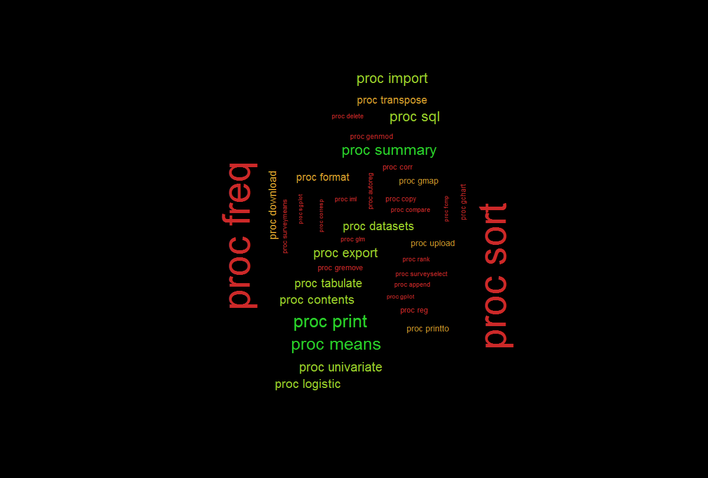

<!-- https://stackoverflow.com/questions/37755037/how-to-add-code-folding-to-output-chunks-in-rmarkdown-html-documents -->
<script src="toggle_output.js"></script>




```{r global_options, include=FALSE}
knitr::opts_chunk$set(fig.width=12, fig.height=8, fig.path='Figs/',
                      echo=T, warning=FALSE, message=FALSE)
```

# Introduction
Ce notebook propose une introduction au data management avec le langage `R` et s'appuyant principalement sur le package `dplyr`.<br>
Nous terminons ce notebook par un exemple d'appel de script `R` dans `SAS` et la réalisation d'un modèle de régression logistique.<br>

# Chargement de packages/librairies dans R
Pour le data management on va principalement s'appuyer sur la librairie `dplyr`, on pourrait aussi utiliser `data.table`.
Pour le chargement de tables SAS on utilise la librarie `haven`.
Pour réaliser des graphiques on utilise `ggplot2`.
```{r message=FALSE, warning=FALSE}
library(dplyr)
library(data.table)
library(haven)
library(ggplot2)
```

# Lecture/chargement de données

Pour charger une table SAS en mémoire dans un data.frame on utilise la fonction `read_sas`.<br>
Pour charger un fichier CSV dans un data.frame on peut utiliser les fonctions `read.csv` ou `read.csv2`.<br>
Le format SAS est bien plus lourd à lire que le format csv, pour gagner du temps de lecture on préférera les exports en CSV.<br>
[Facultatif] Pour des questions de simplicité et de performance on préférera souvent la fonction `fread` (fast read) qui demande moins de paramétrage et est souvent bien plus rapide. Cette fonction provient du package `data.table` et charge les tables dans un format dérivé des `data.frame` qui s'appelle les `data.table`. La syntaxe est différente mais on peut facilement passer de data.frame à data.table et réciproquement pour jongler entre les différentes syntaxes.<br>
Tout comme SAS génère des tables SAS, R peut générer des exports dans un format optimisé pour R, ce format est RData, on sauvegarde/charge ce format avec les fonctions `save`/`load`.
```{r chargement de données, echo=TRUE, message=FALSE, warning=FALSE}
data_sas <- haven::read_sas("data/barometre2016_fin.sas7bdat")
data_csv <- data.table::fread("data/barometre2016_fin.csv")
load("data/barometre2016_fin.RData")
```

```{r include=FALSE}
data_sas=data_sas%>%mutate_if(is.character,factor)
```

# Ecriture de données

On peut écrire des fichiers SAS avec la fonction `write_sas()` pour conserver les formats, mais pour aller au plus vite et au plus standard on préférera écrire des CSV


```{r ecriture de données}
haven::write_sas(data = data_sas,path = "data/barometre2016_fin_fromR.sas7bdat")
save(list=c("data_sas"),file="data/barometre2016_fin.RData")
data.table::fwrite(x = data_sas,file = "data/barometre2016_fin.csv")
```

# Exploration d'un data.frame

## Noms des variables
On peut obtenir le vecteur des noms de chaque variable présente dans le data.frame avec la fonction `names`.
<div class="fold o">
```{r noms de vars}
names(data_sas)
```
</div>
On peut décider de renommer une variable avec la fonction `rename`. Par exemple on veut renommer les variables DEP et sexe en zone et genre

```{r rename}
data_sas%>%rename(zone=DEP,genre=sexe)%>%
  select(zone,genre)
```


## Dimensions du data.frame
On peut connaître les dimensions de la table avec les fonctions `dim` `nrow` `ncol`
```{r dimensions}
dim(data_sas)
ncol(data_sas)
nrow(data_sas)
```


# Inspection rapide des variables

## structure str
On peut utiliser la fonction `str` comme structure pour connaître la structure de chaque variable : type et première observations.
<div class="fold o">
```{r}
str(data_sas)
```
</div>

On peut utiliser la fonction `summary` pour connaître quelques statistiques descriptives sur chaque variable : 
<ul>
<li> si la variable est numérique, on obtient min, 1er quartile, médiane et moyenne (et 3ème quartile et maximum si on appelle la fonction sur une variable spécifique).
<li> si la variable est catégorielle/factorielle, on obtient les 4 modalités les plus présentes ainsi que leur décompte.
<li> si la variable est une chaîne de caractère, aucune stat n'est réalisée parce qu'on suppose que les chaînes de caractère sont des champs textuels libres.
</ul>

## sommaire summary
### sur le data.frame entier
<div class="fold o">
```{r proc contents}
summary(data_sas)
```
</div>

### variable par variable, en sélectionnant sur les variables numériques

<div class="fold o">
```{r proc means}
lapply(data_sas%>%select_if(is.numeric),summary)
```
</div>

## freq/tabulate table

Pour connaître la distribution d'une variable catégorielle, on peut utiliser la fonction `table` qui est assez proche de la PROC FREQ. Pour ajouter les marges ont utilise la fonction `addmargins`.
```{r proc freq count}
decompte_sexe=table(data_sas$sexe)
decompte_sexe
addmargins(decompte_sexe)
```
Si on s'intéresse à la proportion et non au décompte, on peut rapporter le décompte au nombre d'observations non manquantes, ou bien s'intéresse à des fonctions telles que `prop.table`.
```{r proc freq pct 1var}
table(data_sas$sexe)/sum(!is.na(data_sas$sexe))
prop.table(decompte_sexe)
```

Bien sûr on peut réaliser des tableaux croisés sur plusieurs variables. <br>
Vous trouverez des explications supplémentaires en français sur <a href="http://olivier.godechot.free.fr/hoparticle.php?id_art=465">ce site</a>.
<div class="fold o">
```{r proc freq pct 2var}
decompte_sexe_age=table(data_sas$sexe,data_sas$age)
addmargins(decompte_sexe_age)
decompte_sexe_age%>%prop.table(2)%>%addmargins
```
</div>

On peut aussi trouver de l'inspiration avec les packages reshape2, dplyr, data.table et pander.<br>
<a href="https://www.developpez.net/forums/d1578300/autres-langages/autres-langages/r/tableaux-croises-dynamiques-r/">Ici</a> une discussion sur le sujet en français.


# Manipulation de données

## Modification/création de variables 

On peut créer/modifier une/plusieur variables avec les fonctions `mutate`, `mutate_if`, `mutate_at`, `mutate_all`.<br>
Ici on réalise un traitement standard dans R qui consiste à transformer les variables de type chaînes de caractères `character` en variable catégorielle/factorielle `factor`.
```{r}
data_sas=data_sas%>%mutate_if(is.character,factor)
```

## sélection sur variables (keep) ou observations (where ou delete)

### keep
Si on souhaite conserver seulement certaines variables, on peut utiliser la fonction `select` et lister les variables à garder.

<div class="fold o">
```{r select}
data_sas%>%select(annee,DEP,sexe,age,poids_ind,mh5_score)
```
</div>


### remove/delete
Si à l'inverse on souhaite supprimer certaines variables, on peut utiliser la fonction `select` et faire précéder le nom des variables à supprimer d'un signe `-`.

```{r select to remove, echo=TRUE}
data_sas%>%ncol
data_sas%>%select(-mc26s1,-mc26s2)%>%ncol
```

### filter
Si on souhaite ne conserver que les observations telles que la variable mh5_score est supérieure à 90.
```{r filter then select}
data_sas%>%nrow
data_sas%>%filter(mh5_score>90)%>%nrow
```


## unique (distinct)
Si on souhaite supprimer les doublons, on peut utiliser la fonction `unique` ou la fonction `distinct` qui utilise la même syntaxe mais tourne beaucoup plus vite.
```{r}
system.time(data_sas%>%select(annee,DEP,sexe)%>%
  unique())
system.time(data_sas%>%select(annee,DEP,sexe)%>%
  distinct())
```

## le tri
Afin de réaliser un tri sur une ou plusieurs variables, on peut utiliser la fonction `arrange`.

```{r sort}
data_sas%>%
  arrange(age)%>%
  select(annee,DEP,sexe,age,poids_ind,mh5_score)
```


## création de nouvelles variables
On est souvent amené à créer de nouvelles variables, traitons quelques exemples classiques. On fera le plus souvent appel à la fonction `mutate`

### tranches
Disons qu'on souhaite découper la variable âge en tranches de 10 ans.
```
if       age < 10 then tage = "1";
if 10 <= age < 20 then tage = "2";
if 20 <= age < 30 then tage = "3";
if 30 <= age < 40 then tage = "4";
if 40 <= age < 50 then tage = "5";
if 50 <= age < 60 then tage = "6";
if 60 <= age < 70 then tage = "7";
if 70 <= age < 80 then tage = "8";
if 80 <= age      then tage = "9";
```
Le découpage de la variable peut être effectué avec les fonctions `cut` ou `Hmisc::cut2`

```{r}
data_sas%>%mutate(tage=cut(age,breaks = c(min(age),1:7*10,max(age)))) -> data_sas
table(data_sas$tage)
```

### Création de variables par somme ou collage
Disons qu'on veut créer une variable de catégorie age x genre, pour cela on va utiliser `paste`.<br>
On souhaite également compter le nombre de spécialités consultées, on va donc appeler `sum` sur les lignes en précisant `rowwise`. On pourrait tout simplement utiliser l'opérateur `+`.
```{r}
data_sas%>%
  mutate(age_sexe=paste(sexe,age,sep="_"))%>%
  rowwise() %>% 
  mutate(consult = sum(consult_mg,
                       consult_dentiste,
                       consult_gyneco,
                       consult_opht, 
                       na.rm=TRUE)) -> data_sas
data_sas$age_sexe%>%table%>%sort(decreasing = T)%>%head(10)
data_sas$consult%>%table

```

### [Niveau avancé] lag (décalage)
Cet exemple et très complet et fait appel aux fonctions `filter`, `group_by`, `summarise`, `arrange`, `mutate`, `ggplot`, pour gagner quelques lignes de code on fait même appel à la fonction `set` (`:=`) de `data.table` pour faire un group_by "sur place".<br>
On étudie parfois des séries temporelles ou données de panel et on a besoin de comparer $X_t$ avec $X_{t-1}$, pour cela on doit créer une variable de retard/lag, par groupe.<br>
Par exemple, disons qu'on veut comparer, à genre et zone donnés, le niveau d'isolement à l'âge A et à l'âge A+1.

```{r}
# niveau d'isolement par âge, genre, zone
data_sas%>%
  filter(age>50)%>%
  group_by(DEP,age,sexe)%>%
  summarise(volume=n(),
            # volume_noNA=sum(!is.na(sd_vitseul)),
            isolement=sum(sd_vitseul=="Oui"),
            tx_isolement=isolement/volume)%>%
  arrange(DEP,sexe,age)%>%
  data.table-> data_sas_dt
#lag par genre et zone
data_sas_dt[,c("tx_isolement_lag"):=list(lag(tx_isolement)),by=c("DEP","sexe")]

#ratio et visualisation pour une zone et un genre donnés
data_sas_dt%>%
  mutate(tx_isolement_ratio=tx_isolement/tx_isolement_lag)%>%
  filter(DEP=="Métropole"&sexe=="Femmes")%>%
  mutate(volume=volume/mean(volume))%>%
  ggplot() -> g

g+geom_line(aes(x=age,y=tx_isolement_ratio))+geom_col(aes(x=age,y=volume),alpha=.1)

```


## group by

On veut conserver uniquement les CSP "Q23" telles que mh5_score est CONNU au moins 10 fois. On va faire appel à `group_by` et `summarise` puis `filter`.

```{r group by simple}
nb_Q23=data_sas%>%
  group_by(Q23)%>%
  summarise(mh5_filled_in_Q23=sum(!is.na(mh5_score)))%>%
  filter(mh5_filled_in_Q23>10)
```

## jointure (merge)

Afin de filter les observations pour garder uniquements celles dont la classe Q23 compte au moins 10 mh5_score renseignés (non manquants). Pour cela on fait un inner-join sur la table générée précédemment.
```{r join vs proc sql}
data_sas_sub=merge(data_sas,nb_Q23,by="Q23", all.x=F,all.y=F)
```


Pour réaliser la même opération on aurait pû utiliser une syntaxe data.table : 

```{r}
data_sas=data.table(data_sas)
data_sas[,"mh5_filled_in_Q23":=sum(!is.na(mh5_score)),by="Q23"]
data_sas_sub=data_sas[mh5_filled_in_Q23>10]
```


# proc compare
## Exemple simple
### Code SAS
```
DATA version1;
   INPUT id $ age sexe;
   DATALINES;
1 20 1
2 30 2
3 40 2
4 50 1
5 60 2
	;
RUN;

DATA version2;
   INPUT id $ age;
   DATALINES;
1 20
2 30
3 30
5 70
	;
RUN;

PROC COMPARE DATA = version1
			COMPARE = version2;
	ID id;
RUN;
```
### package arsenal
```{r}
library(arsenal)
version1=data.frame(id=1:5,age=c(2:6*10),sexe=sample(1:2,replace = T,size = 5))
version2=data.frame(id=c(1,2,3,5),age=c(20,30,30,70))
exemple1=compare(version1, version2,by="id")
exemple1$vars.summary$values[[2]]
# summary(exemple1)
# diffs(exemple1)
```

## Autre exemple 
### data
```{r include=FALSE}
d1 <- structure(list(Last_Name = c("Doe", "Doe", "Don", "Smith"), First_Name = c("John", 
"Jane", "Bob", "Mike"), Street_Address = c("1234 Main St", "4321 Tower St", 
"771  North Ave", "732 South Blvd."), ZIP = c(12345L, 54321L, 
23232L, 77777L), VisitCount = c(20L, 10L, 5L, 3L)), .Names = c("Last_Name", 
"First_Name", "Street_Address", "ZIP", "VisitCount"), class = "data.frame", row.names = c(NA, -4L))                                                                                                               

d2 <- structure(list(Last_Name = c("Doe", "Doe", "Donn"), First_Name = c("John", 
"Jane", "Bob"), Street_Address = c("1234 Main St", "4111 Tower St", 
"771  North Ave"), ZIP = c(12345L, 32132L, 11111L), VisitCount = c(20L, 
17L, 5L)), .Names = c("Last_Name", "First_Name", "Street_Address", 
"ZIP", "VisitCount"), class = "data.frame", row.names = c(NA, -3L))
```


```{r}
d1
```
```{r}
d2
```

### Package arsenal
https://cran.r-project.org/web/packages/arsenal/vignettes/compare.html

```{r}
library(arsenal)
comparison=compare(d1,d2)
comparison
```
<div class="fold o">
```{r}
summary(comparison)
```
</div>
<div class="fold o">
```{r}
summary(compare(d1,d2,by=c("Last_Name","First_Name")))
```
</div>

```{r}
diffs(comparison)
```
```{r}
diffs(comparison,by.var=T)
```

### Une piste intéressante avec data.table

https://stackoverflow.com/questions/28056805/find-discrepancies-between-two-tables

```{r include=FALSE}
d1 <- structure(list(Last_Name = c("Doe", "Doe", "Don", "Smith"), First_Name = c("John", 
"Jane", "Bob", "Mike"), Street_Address = c("1234 Main St", "4321 Tower St", 
"771  North Ave", "732 South Blvd."), ZIP = c(12345L, 54321L, 
23232L, 77777L), VisitCount = c(20L, 10L, 5L, 3L)), .Names = c("Last_Name", 
"First_Name", "Street_Address", "ZIP", "VisitCount"), class = "data.frame", row.names = c(NA, -4L))                                                                                                               

d2 <- structure(list(Last_Name = c("Doe", "Doe", "Donn"), First_Name = c("John", 
"Jane", "Bob"), Street_Address = c("1234 Main St", "4111 Tower St", 
"771  North Ave"), ZIP = c(12345L, 32132L, 11111L), VisitCount = c(20L, 
17L, 5L)), .Names = c("Last_Name", "First_Name", "Street_Address", 
"ZIP", "VisitCount"), class = "data.frame", row.names = c(NA, -3L))
```

```{r}
setDT(d1)
d1 <- d1[, list(VarName = names(.SD), TableOne = unlist(.SD, use.names = F)),by=c('Last_Name','First_Name')]

setDT(d2)
d2 <- d2[, list(VarName = names(.SD), TableTwo = unlist(.SD, use.names = F)),by=c('Last_Name','First_Name')]

# Set keys for merging
setkey(d1,Last_Name,First_Name,VarName)

# Merge, remove duplicates
d1[d2,nomatch=0][TableOne!=TableTwo]
```


# fonctions pour les chaînes de caractère

## find, count dans SAS

Où est la première occurrence de "consult" ?
`match = find(nm, "consult");`

Combien d'occurrence de l'expression "consult" ? 
`howmany = count(nm, "consult");`

## grep

Concept plus riche avec <a href="https://fr.wikipedia.org/wiki/Grep">grep</a>

```{r}
nm=names(data_sas)
nm[grep(pattern = "consult",x = nm)]
```

## substr

```{r substr}
data_sas%>%
  select(Q32_spec_1)%>%
  mutate(Q32_spec_char=as.character(Q32_spec_1),
         Q32_spec_len=nchar(Q32_spec_char))%>%
  filter(Q32_spec_len>1)%>%
  mutate(Q32_spec_1a3=substr(Q32_spec_char,start = 1,stop = 3))%>%
  select(Q32_spec_char,Q32_spec_1a3)
```

# Fonctions de simulation/échantillonnage

## Tirage aléatoire
On s'intéresse à la variable`Q32_spec_1` relative aux spécialités médicales.
On veut simuler un vecteur de 1000 spécialistes.
On commence par calculer la distribution des modalités avec un équivalent proc freq : `table` puis on réalise le tirage aléatoire pondéré avec la fonction `sample`

<div class="fold o">
```{r sample vs proc surveyselect}
freq_Q33=data_sas%>%filter(!Q32_spec_1=="")%>%
                              mutate(Q32_spec_1=as.character(Q32_spec_1))%>%
                              select(Q32_spec_1)%>%table
freq_Q33
sample(x = names(freq_Q33),size=1000,replace = T,prob = freq_Q33)
```
</div>


# Retour aux PROC classiques

## Proc FREQ 100% paramétrable
Un équivalent proc freq avec des ajustements de mise en forme : pourcentage avec symbole % et arrondi à 2 décimales.
<div class="fold o">
```{r}
lapply(data_sas%>%
         select_if(is.factor)%>%.[,1:10],
       function(x){
        x%>%
           tibble()%>%
           group_by_all()%>%
           summarise(volume=n(),
                     len=length(x),
                     freq_pct=round(100*volume/len,2),
                     freq_print=paste0(freq_pct,"%")
                     )%>%
           arrange(-freq_pct)%>%
           select(-volume,-len,-freq_pct)
})
```
</div>


## proc means, univariate, summary

```{r}
data_sas%>%
  filter(DEP%in%c("Métropole","Martinique"))%>%
  filter(!is.na(mh5_score))%>%
  group_by(age,sexe)%>%
  summarise(
    volume=n(),
    pond=sum(poids_ind),
    bonnesante_w=weighted.mean(bonnesante,w=poids_ind,na.rm=T),
    mh5_score_dec1=quantile(mh5_score,.1),
    mh5_score_dec9=quantile(mh5_score,.9),
    mh5_score_sd=sd(mh5_score),
    mh5_score_cl_inf=t.test(mh5_score)$conf.int[1],
    mh5_score_cl_sup=t.test(mh5_score)$conf.int[2],
    pbdent_w=weighted.mean(pbdent,w=poids_ind,na.rm=T))%>%
  arrange(age)

```


# Outils supplémentaires

## les boucles
cf formation 

`do i = 1 %to 4`
```{r for loops}
for (i in 1:4){
  print(i^2)
}

```

## les fonctions/macro

cf formation


# GLM

## GLM basique
GLM, choix des levels dans le GLM

https://stackoverflow.com/questions/23282048/logistic-regression-defining-reference-level-in-r
<div class="fold o">
```{r}

data_sas%>%
  mutate(sexe = relevel(sexe, ref = "Femmes"),
         sd_diplome3 = relevel(sd_diplome3, ref = "< Bac"),
         sd_sitprof_6 = relevel(sd_sitprof_6, ref = "Chomage"),
         sit_financiere_percue = relevel(sit_financiere_percue, ref = "Ca va"),
         sd_revenus_3K = relevel(sd_revenus_3K, ref = "1er tercile (faible)")
  ) -> data_sas


logistic <- glm(bonnesante ~ age + sexe + sd_diplome3 + sd_sitprof_6 + sit_financiere_percue + sd_revenus_3K ,family=binomial(link=logit), data=data_sas%>%filter(DEP=="Métropole"), na.action = na.exclude)

summary(logistic)

```
</div>

## GLM interactions

<div class="fold o">
```{r}
logistic <- glm(bonnesante ~ tage*sexe + sd_diplome3 + sd_sitprof_6 + sit_financiere_percue + sd_revenus_3K ,family=binomial(link=logit), data=data_sas%>%filter(DEP=="Métropole"), na.action = na.exclude)

summary(logistic)
```
</div> 

## Stepwise
Il est bien sûr possible de sélectionner des variables par méthode stepwise/forward/backward de manière "brutale" (brute-force), mais ce n'est pas recommandé pour de nombreuses raisons dont le risque d'overfitting et les temps de calcul trop longs.<br>
<ul>
<li> MASS::stepAIC 
<li> stats::step
</ul>

## régularisation/pénalisation (RIDGING)
Le package glmnet permet de faire des régressions L1 (LASSO), L2 (RIDGE) et Elastic-Net (mix L1-L2).<br>
Vous trouverez dans la <a href="https://www.rdocumentation.org/packages/glmnet/versions/2.0-12/topics/glmnet">documentation</a> de très bons exemples en bas du document.


# Invocation de script R depuis SAS
Un exemple concret a été réalisé dans le contexte d'un projet de microsimulation des retraites. Une brique intermédiaire d'imputation a été codée en R et est maintenant invoquée depuis le "main.sas".<br>
Pour cela il faut  
<ul>
<li> Installer R sur l'ordinateur
<li> Trouver le chemin vers le fichier Rscript.exe, dans mon cas `C:\Users\phileas.condemine\Documents\R\R-3.4.3\bin\Rscript.exe`
<li> Trouver le chemin vers le script R à éxécuter, dans mon cas `C:\Users\phileas.condemine\Documents\MicroSim\retraite\Programmes_R\Import_data_R.R`
<li> Un certain nombre de paramètres peuvent être renseignés dans la fonction, dans ce cas on a 5 paramètres : generation, working_directory, output_directory, path_to_excel_input, path_to_sas_input. Il faut renseigner les paramètres dans le bon ordre.
<li> L'appel de R par SAS s'appuie sur la fonction `pipe`.
<li> Voici le programme SAS qui invoque le script R.
</ul>

```
options noxwait xsync;
filename proc_r pipe "C:\Users\phileas.condemine\Documents\R\R-3.4.3\bin\Rscript.exe --vanilla C:\Users\phileas.condemine\Documents\MicroSim\retraite\Programmes_R\Import_data_R.R 1976 C:/Users/phileas.condemine/Documents/MicroSim/retraite/ base_en_sortie/ Base_en_entree/ import_prepared_by_sas/";
data _null_;
infile proc_r;
run;
```

# Documentation 
https://gitlab.com/DREES_code/OUTILS/Trucs_et_Astuces_en_R

Une documentation SAS->R à destination des statisticiens en laboratoires pharmaceutiques : <br>
https://www.lexjansen.com/phuse/2014/ad/AD04.pdf <br>
références aux PROC : IMPORT, CONTENTS, SQL, PRINT, MEANS, BOXPLOT, TTEST, SGPANEL, GLM, REG, ANOVA, MIXED, DOCUMENT <br>


